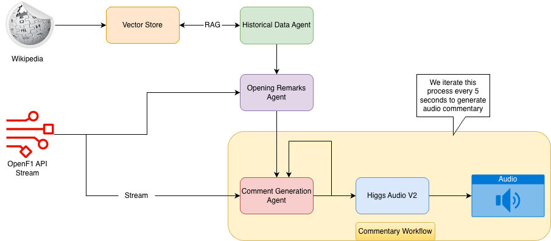

# 🏎️ F1 AI Commentator

### Autonomous Real-Time Formula 1 Race Commentary with AI Agents

---

## Overview

The **F1 AI Commentator System** is an intelligent, end-to-end pipeline that autonomously generates **real-time Formula 1 race commentary** by fusing live telemetry with external knowledge sources.  

It integrates **structured race data** from the [OpenF1 API](https://openf1.org/) with **unstructured context** from Wikipedia, enabling dynamic, context-aware narration.  

The system employs multiple **specialized AI agents** for contextual understanding, insight generation, predictive commentary, and speech synthesis — producing live, human-like narration using **Higgs Audio V2** and voice cloning (e.g., **David Croft’s iconic tone**).

---
## Sample
### 🎬 Video
<video controls width="640">
  <source src="simulation/F1_Simulation_Video_Without_Audio.mp4" type="video/mp4">
  Your browser does not support the video tag.
</video>

### 🔈 Audio Demo
<audio controls>
  <source src="data/commentary/output/audio_without_background_noise.wav" type="audio/wav">
  Your browser does not support the audio tag.
</audio>

--- 

## System Architecture

### 1. **Data Sources**

- **Wikipedia**  
  Provides historical and contextual knowledge such as team histories, driver profiles, track stats, and race outcomes.  
  These unstructured texts are **embedded and stored in a Vector Store** for semantic retrieval.

- **OpenF1 API Stream**  
  Supplies real-time telemetry including driver positions, lap times, and race events (e.g., pit stops, retirements).

---

### 2. **Vector Store**

A **retrieval layer** holding embeddings of Formula 1–related Wikipedia data.  
It enables **context-aware lookups** during live commentary to inject historical facts and insights seamlessly.

---

### 3. **Agents**

- **Historical Data Agent**  
  Retrieves relevant insights (e.g., rivalries, prior race results) from the Vector Store to enrich live commentary.  

- **Opening Remarks Agent**  
  Generates the race introduction (e.g., “Welcome to the 2024 Singapore Grand Prix”), summarizes grid positions, and adds historical flavor.  

- **Comment Generation Agent**  
  The **core orchestrator** that combines:  
  - Live telemetry from OpenF1  
  - Context from the other agents  
  It then outputs **structured natural-language commentary**, narrating overtakes, pit stops, performance trends, and race predictions.

---

### 4. **Audio Generation**

- **Higgs Audio V2**  
  Converts text commentary into expressive, real-time voice narration.  
  This ensures human-like cadence, tone, and energy, producing a **broadcast-quality AI commentary stream**.

---

### 5. **Output**

The final product is a **live, AI-driven commentary stream** that replicates professional broadcasting:
- Accurate real-time analysis  
- Historical and contextual insights  
- Natural voice delivery through **Higgs Audio V2**

---

## Key Features

| Feature | Description |
|----------|--------------|
| **Data Integration** | Combines static Wikipedia data with dynamic OpenF1 telemetry. |
| **Agent Modularity** | Independent AI agents make the system scalable and debuggable. |
| **Contextual Awareness** | Seamlessly references history and narrative continuity. |
| **Speech Synthesis** | Uses Higgs Audio V2 for lifelike voice cloning and delivery. |

---

## 🏁 Use Case: *2024 Singapore Grand Prix*

The system generated:
- Opening remarks highlighting circuit characteristics and historical moments.  
- Live commentary tracking **position changes**, **pit strategies**, and **driver performance**.  
- Broadcast-quality **audio narration** in real time.

This demonstrates how AI-driven systems can blend **analytics** and **storytelling** for immersive sports coverage.

---

## 🔬 Research Findings

### Impact of Background Noise on Higgs Audio V2

An experiment tested the impact of **background noise** in reference audio during voice cloning.

**Setup:**  
Reference audio contained high-pitched Formula 1 car sounds.

**Findings:**
- Generated audio showed **noticeable distortions**.  
- Clean, noise-free reference audio is essential for accurate voice reproduction.

**Supporting Materials:**
- `reference_audio.wav` – Original speaker audio with F1 background noise  
- `generated_audio.wav` – Output demonstrating distortion  
- `text_script.txt` – Commentary used for synthesis

> “The 2024 Singapore Grand Prix is underway under the neon lights of Marina Bay. Verstappen starts from pole with Norris alongside in second... Expect drama, overtakes, and a legendary night in the city-state.”

**Conclusion:**  
Preprocessing and denoising are **critical** to maintaining high-quality output when using Higgs Audio V2.

---

##  Conclusion

The **F1 AI Commentator System** exemplifies a cutting-edge fusion of:
- **Retrieval-Augmented Generation (RAG)**  
- **Real-time streaming data**  
- **AI speech synthesis**

It highlights how modular AI pipelines can **transform structured and unstructured data** into rich, dynamic, and human-like commentary — redefining the future of **autonomous sports broadcasting**.

---

## 🔗 GitHub Repository

 [**F1 Live Commentator**](#) — Explore the full source code and architecture.

---
